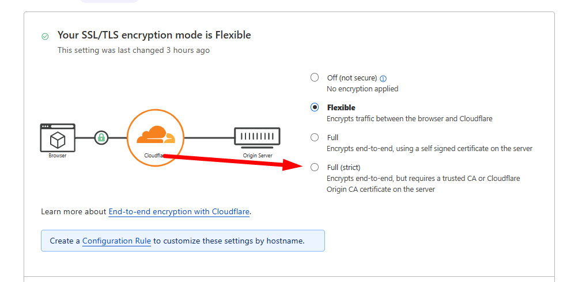
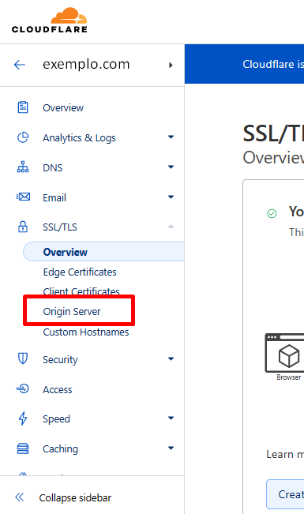
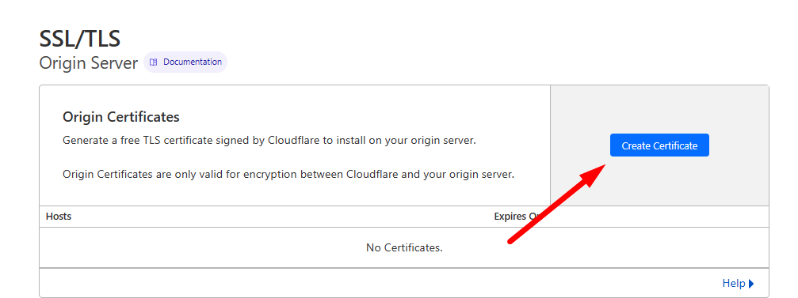
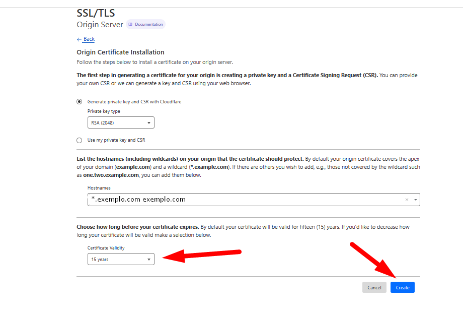
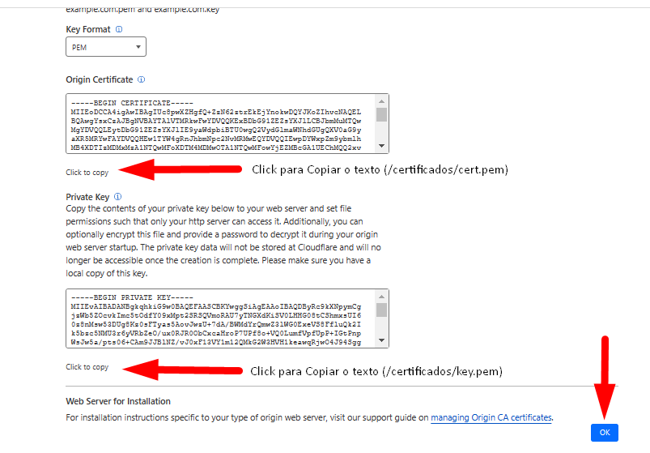

# CloudFlare SSL/TLS

## Configurar o sistema de segurança da CloudFlare SSL/TLS

### CloudFlare

Acesse o painel do CloudFlare e adicione seu domínio ao seu projeto. Certifique-se de que o ícone de nuvem esteja laranja para que o tráfego seja roteado por meio do CloudFlare.


Clique na guia "SSL/TLS" no painel do CloudFlare e selecione "Full (strict)" como o nível de segurança.




Faça o download do certificado SSL do CloudFlare. Para fazer isso, clique em "Origin Server" na seção "Origin Certificates" e selecione "Generate Certificate". Siga as instruções para gerar o certificado SSL.





Nesta parte você pode mudar o Tempo do Certificado(Porem não é necessario), recomendado mesmo é apenas criar em "Create"



Após isso, Você deve abrir o terminal e criar uma pasta aonde será armazenada o certificado. e em seguida criar o documento copiando e colocando o código da chave e o certificado recebido do CloudFlare.



```bash
# Para criar o diretório dos Certificados
mkdir /certificados

# Cole o texto que esta no "Origin Certificate"
nano /certificados/cert.pem

# Cole o texto que esta no "Private Key"
nano /certificados/key.pem
```

:::info Atenção
Após isso a configuração basica está feita, Selecione Qual Tipo de Servidor Web você está usando, bem como as wings para continuar a segunda parte.
:::

#### Configurar Wings

[Configurar as Wings](./wings-ssl-tls.md)

#### Se for Nginx

[Configurar o Nginx](./3%20-%20Servidor%20Web/nginx-ssl.md)

#### Se for Apache

[Configurar o Apache](./3%20-%20Servidor%20Web/apache-ssl.md)